# Anfeca

## API Routes
### Authentication
| Purpose                | Method | Route                                | Consumes                                          | Returns                                            |
|------------------------|--------|--------------------------------------|---------------------------------------------------|----------------------------------------------------|
| Login                  | POST   | `/api/auth/login`                    | JSON object `{ email, password }`                 | Access token and refresh token                     |
| Register               | POST   | `/api/auth/register`                 | JSON object `{ name, lastName, email, password }` | Success message, JSON Guardian and Account objects |         
| Send verification code | POST   | `/api/auth/verification-code`        | JSON object `{ email }`                           | Success message                                    |
| Verify code            | POST   | `/api/auth/verification-code/verify` | JSON object `{ email, code }`                     | Success message                                    |
| Refresh access token   | POST   | `/api/auth/token/refresh`            | JSON object `{ refreshToken }`                    | New access token                                   |
| Validate email         | POST   | `/api/auth/validation/email`         | JSON object `{ email }`                           | Success message or invalid email message           |
| Validate password      | POST   | `/api/auth/validation/password`      | JSON object `{ password }`                        | Success message or invalid password message        |

### Account
| Purpose                  | Method | Route                          | Consumes                                                                   | Returns                                                             |
|--------------------------|--------|--------------------------------|----------------------------------------------------------------------------|---------------------------------------------------------------------|
| Delete account           | DELETE | `/api/account/`                | Nothing                                                                    | Success message                                                     |
| Switch profile           | POST   | `/api/account/profiles/switch` | JSON `{ targetProfile: "guardian", password } or { targetProfile: "kid" }` | Success message, new access token and new fresh token               |
| Get current profile info | GET    | `/api/account/profiles/`       | Nothing                                                                    | Message stating the current profile and JSON guardian or kid object |
| Get profiles names       | GET    | `/api/account/profiles/names`  | Nothing                                                                    | JSON object { guardian, kid }                                       |                                        

⚠️⚠️⚠️ When switching account, a new fresh token is generated, to every time the user switch profile, frontend must store a new fresh token

Get current profile info

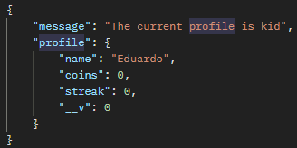

Get profiles' names

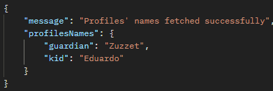

### Kid
| Purpose            | Method | Route              | Consumes               | Returns                 |
|--------------------|--------|--------------------|------------------------|-------------------------|
| Create kid profile | POST   | `/api/kids/`       | JSON Object `{ name }` | JSON Kid profile object |
| get coins          | GET    | `/api/kids/coins`  | Nothing                | { coins }               | 
| get streak         | GET    | `/api/kids/streak` | Nothing                | { streak }              |

### Questions bank
| Purpose                     | Method | Route                                                                      | Consumes                                          | Returns                                                                             |
|-----------------------------|--------|----------------------------------------------------------------------------|---------------------------------------------------|-------------------------------------------------------------------------------------|
| Get all banks               | GET    | `/api/banks/`                                                              | Nothing                                           | Success message, Array of JSON banks objects                                        |
| Create a bank               | POST   | `/api/banks/`                                                              | JSON Object `{ name }`                            | Success message, JSON bank object                                                   |
| Get a bank                  | GET    | `/api/banks/:bankId`                                                       | Nothing                                           | Success message, JSON bank object                                                   | 
| Edit a bank                 | PUT    | `/api/banks/:bankId`                                                       | { fields that are updated }                       | Success message, JSON updated bank                                                  |
| Delete a bank               | DELETE | `/api/banks/:bankId`                                                       | Nothing                                           | Success message                                                                     |
| Get all questions           | GET    | `/api/banks/:bankId/questions/`                                            | Nothing                                           | Success message, Array of JSON question object                                      |
| Create a question           | POST   | `/api/banks/:bankId/questions/`                                            | JSON Object `{ textQuestion, answers, priority }` | Success message, JSON question object                                               |
| Get a question              | GET    | `/api/banks/:bankId/questions/:questionId`                                 | Nothing                                           | Success message, JSON question object                                               |
| Edit a question             | PUT    | `/api/banks/:bankId/questions/:questionId`                                 | { fields that are updated }                       | Success message, JSON updated question                                              |
| Delete a question           | DELETE | `/api/banks/:bankId/questions/:questionId`                                 | Nothing                                           | Success message                                                                     |
| Start study session         | GET    | `/api/banks/:bankId/flashcards/study-session`                              | Nothing                                           | {sessionId front, back}                                                             |
| Get the following flashcard | POST   | `/api/banks/:bankId/flashcards/study-session/:studySessionId/:flashcardId` | { feedback }                                      | Flashcard JSON object with id, front and back; or message "Study session complete!" |

- `:bankId` is the questions bank ID
- `answers` in JSON Object must be an array of objects, max of 4 answers, at least one correct and one incorrect
- `feedback` must be a number from 1 to 4. E.g. { "feedback": 4 }
- `front` is the text question, `back` is the correct answer(s) 
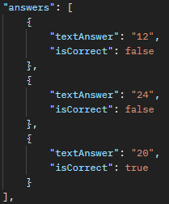

- start study session returns this

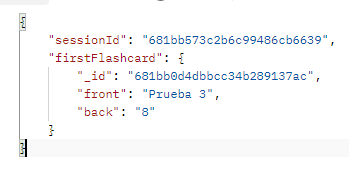

## Game
| Purpose          | Method | Route                                     | Consumes                                                                | Returns                       |
|------------------|--------|-------------------------------------------|-------------------------------------------------------------------------|-------------------------------|
| Fetch questions  | GET    | `/api/game/:bankId/start-game`            | Nothing                                                                 | { sessionId, questions }      |
| Send game result | POST   | `/api/game/:bankId/:gameSessionId/result` | { "questions": [{"question", "answeredCorrectly"}], "individualCoins" } | Success message, earned coins |

- fetch questions returns this

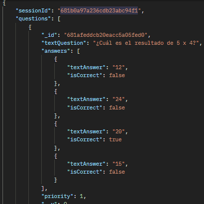

- `questions` is the array with the 5 questions that will be displayed in the game
- The request for `/api/game/:bankId/:gameSessionId/result` must be like this:

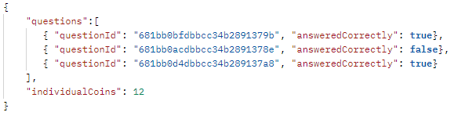

### Reward
| Purpose                           | Method | Route                                             | Consumes                                                                                  | Returns                                                   |
|-----------------------------------|--------|---------------------------------------------------|-------------------------------------------------------------------------------------------|-----------------------------------------------------------|
| Get all rewards                   | GET    | `/api/rewards/`                                   | Nothing                                                                                   | Success message, Array of JSON banks objects              |
| Create reward                     | POST   | `/api/rewards/`                                   | JSON Object `{ name, price, type }` or `{ name, price, type, redemptionLimit }` if needed | Success message, JSON Reward object                       |
| Get a reward                      | GET    | `/api/rewards/:rewardId`                          | Nothing                                                                                   | Success message, JSON Reward object                       |
| Edit a reward                     | PUT    | `/api/rewards/:rewardId`                          | { fields that are updated }                                                               | Success message, JSON updated reward                      |
| Delete a reward                   | DELETE | `/api/rewards/:rewardId`                          | Nothing                                                                                   | Success message                                           |
| Redeems reward                    | POST   | `/api/rewards/:rewardId/redeem`                   | Nothing                                                                                   | 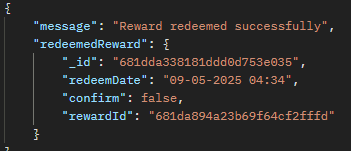                                   |
| Get all redeemed reward           | GET    | `/api/rewards/redeemed-rewards`                   | Nothing                                                                                   | Array with the redeemed rewards  |                     
| Guardian confirms redeemed reward | POST   | `/api/rewards/redeemed-rewards/:redeemedRewardId` | Nothing                                                                                   | 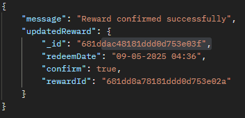                                 |
- `type` is an enum `[once, forever, custom]`, if the user selects `custom` then the front must send `redemptionLimit`

Without `redemptionLimit`
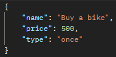

With `redemptionLimit`
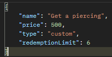

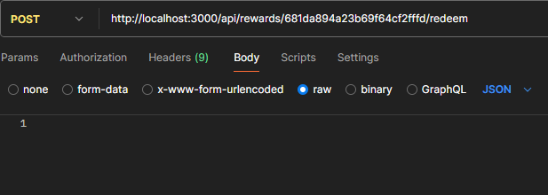

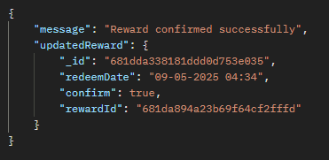

## ConcentraTDA Google acc
- anfecaconcentratda@gmail.com  
- Password321

## command to install dependencies 
`npm i bcrypt cors dotenv express jsonwebtoken mongodb mongoose sib-api-v3-sdk joi luxon`
`npm i --save-dev chai@^4.3.7 chai-http@^4.3.0 chai-as-promised@^8.0.1 mocha@^11.1.0 sinon@^20.0.0 cross-env@^7.0.3 sinon`

## command to run the API
`node back/src/server.js`

## Account registered
zuzzet.hs14@gmail.com
Hola123*

## Technologies used
- Node.js
- Express
- MongoDB + Mongoose
- JWT
- joi
- Brevo API

## docs I've been using
- [Mongoose ](https://mongoosejs.com/docs/validation.html#custom-validators)
- [Nodemailer](https://www.nodemailer.com/)
- [Brevo](https://developers.brevo.com/reference/sendtransacemail)
- [Express](https://expressjs.com/)
- [crypto](https://nodejs.org/api/crypto.html#cryptorandomintmin-max-callback) 
- [express-rate-limit](https://www.npmjs.com/package/express-rate-limit) 
- [JSON Web Token](https://jwt.io/introduction) 
- [Auth0](https://auth0.com/blog/refresh-tokens-what-are-they-and-when-to-use-them/) 
- [JWT & Refresh tokens](https://dev.to/jeanvittory/jwt-refresh-tokens-2g3d)  
- [refresh tokens](https://auth0.com/docs/secure/tokens/refresh-tokens)
- [REST API URI Naming Conventions](https://restfulapi.net/resource-naming/)
- [HTTP response codes in RESTful APIs](https://medium.com/@jamala.zawia/understanding-http-response-codes-in-restful-apis-57ab332c13f3)
- [joi](https://joi.dev/api/?v=17.13.3)

## Frontend commands for ANFECA project (React Native + Expo)

npm install
npm install lucide-react-native
npm install axios
npx expo install expo-secure-store

# Useful Git commands

## Traer una carpeta específica desde una rama remota
git checkout origin/rama -- carpeta/

## Actualizar referencias de ramas remotas
git fetch origin

## Ver ramas remotas disponibles
git branch -r

## Ver el contenido (archivos) de un directorio en una rama remota
git ls-tree --name-only origin/rama

## Revertir todos los cambios en archivos modificados (soft reset)
git restore .

## Eliminar archivos no versionados (nuevos)
git clean -fd

## Quitar un archivo o carpeta del staging
git restore --staged directorio/archivo

## Crear una nueva rama remota a partir de una local
git push -u origin rama-prueba

## Fusionar otra rama con la rama actual
git merge nombre-rama

## Subir cambios de la rama actual al repositorio remoto
git push origin nombre-rama

## Crear una nueva rama local basada en una rama remota
git checkout -b nueva-rama origin/rama-remota

## Eliminar una rama local
git branch -d nombre-rama   # Usa -D si no está fusionada

## Eliminar una rama remota
git push origin --delete nombre-de-la-rama

## Usar VS Code como editor por defecto para Git (en lugar de Vim)
git config --global core.editor "code --wait"

## Abrir VS Code para escribir un commit multilinea
git commit --edit

## Comparar diferencias entre ramas
git diff rama-1..rama-2 --name-status

