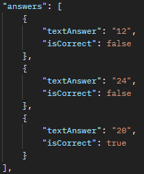
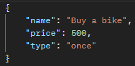
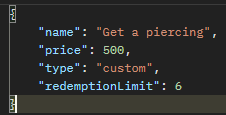

# Anfeca

## API Routes
### Authentication
| Purpose                | Method | Route                                | Consumes                                          | Returns                                            |
|------------------------|--------|--------------------------------------|---------------------------------------------------|----------------------------------------------------|
| Login                  | POST   | `/api/auth/login`                    | JSON object `{ email, password }`                 | Access token and refresh token                     |
| Register               | POST   | `/api/auth/register`                 | JSON object `{ name, lastName, email, password }` | Success message, JSON Guardian and Account objects |         
| Send verification code | POST   | `/api/auth/verification-code`        | JSON object `{ email }`                           | Success message                                    |
| Verify code            | POST   | `/api/auth/verification-code/verify` | JSON object `{ email, code }`                     | Success message                                    |
| Refresh access token   | POST   | `/api/auth/token/refresh`            | JSON object `{ refreshToken }`                    | New access token                                   |
| Validate email         | POST   | `/api/auth/validation/email`         | JSON object `{ email }`                           | Success message or invalid email message           |
| Validate password      | POST   | `/api/auth/validation/password`      | JSON object `{ password }`                        | Success message or invalid password message        |

### Kid
| Purpose                | Method | Route        | Consumes                         | Returns                 |
|------------------------|--------|--------------|----------------------------------|-------------------------|
| Create kid profile     | POST   | `/api/kids/` | JSON Object `{ name }`           | JSON Kid profile object |

### Questions bank
| Purpose           | Method | Route                                      | Consumes                                          | Returns                                        |
|-------------------|--------|--------------------------------------------|---------------------------------------------------|------------------------------------------------|
| Get all banks     | GET    | `/api/banks/`                              | Nothing                                           | Success message, Array of JSON banks objects   |
| Create a bank     | POST   | `/api/banks/`                              | JSON Object `{ name }`                            | Success message, JSON bank object              |
| Get a bank        | GET    | `/api/banks/:bankId`                       | Nothing                                           | Success message, JSON bank object              | 
| Delete a bank     | DELETE | `/api/banks/:bankId`                       | Nothing                                           | Success message                                |
| Get all questions | GET    | `/api/banks/:bankId/questions/`            | Nothing                                           | Success message, Array of JSON question object |
| Create a question | POST   | `/api/banks/:bankId/questions/`            | JSON Object `{ textQuestion, answers, priority }` | Success message, JSON question object          |
| Get a question    | GET    | `/api/banks/:bankId/questions/:questionId` | Nothing                                           | Success message, JSON question object          |
| Delete a question | GET    | `/api/banks/:bankId/questions/:questionId` | Nothing                                           | Success message                                |
- `:bankId` is the questions bank ID
- `answers` in JSON Object must be an array of objects, max of 4 answers, at least one corrrect and one incorrect

### Reward
| Purpose         | Method | Route                    | Consumes                                                                                  | Returns                                      |
|-----------------|--------|--------------------------|-------------------------------------------------------------------------------------------|----------------------------------------------|
| Get all rewards | GET    | `/api/rewards/`          | Nothing                                                                                   | Success message, Array of JSON banks objects |
| Create reward   | POST   | `/api/rewards/`          | JSON Object `{ name, price, type }` or `{ name, price, type, redemptionLimit }` if needed | Success message, JSON Reward object          |
| Get a reward    | GET    | `/api/rewards/:rewardId` | Nothing                                                                                   | Success message, JSON Reward object          |
| Delete a reward | DELETE | `/api/rewards/:rewardId` | Nothing                                                                                   | Success message                              |
- `type` is an enum `[once, forever, custom]`, if the user selects `custom` then the front must send `redemptionLimit`

Without `redemptionLimit`

With `redemptionLimit`

## ConcentraTDA Google acc
- anfecaconcentratda@gmail.com  
- Password321

## command to install dependencies 
`npm i bcrypt cors dotenv express jsonwebtoken mongodb mongoose sib-api-v3-sdk joi`

## command to run the API
`node back/src/app.js`

## Account registered
zuzzet.hs14@gmail.com
Hola123*

## Technologies used
- Node.js
- Express
- MongoDB + Mongoose
- JWT
- ~~joi~~ I'll implement it later
- Brevo API

## docs I've been using
- [Mongoose ](https://mongoosejs.com/docs/validation.html#custom-validators)
- [Nodemailer](https://www.nodemailer.com/)
- [Brevo](https://developers.brevo.com/reference/sendtransacemail)
- [Express](https://expressjs.com/)
- [crypto](https://nodejs.org/api/crypto.html#cryptorandomintmin-max-callback) 
- [express-rate-limit](https://www.npmjs.com/package/express-rate-limit) 
- [JSON Web Token](https://jwt.io/introduction) 
- [Auth0](https://auth0.com/blog/refresh-tokens-what-are-they-and-when-to-use-them/) 
- [JWT & Refresh tokens](https://dev.to/jeanvittory/jwt-refresh-tokens-2g3d)  
- [refresh tokens](https://auth0.com/docs/secure/tokens/refresh-tokens)
- [REST API URI Naming Conventions](https://restfulapi.net/resource-naming/)
- [HTTP response codes in RESTful APIs](https://medium.com/@jamala.zawia/understanding-http-response-codes-in-restful-apis-57ab332c13f3)
- [joi](https://joi.dev/api/?v=17.13.3)